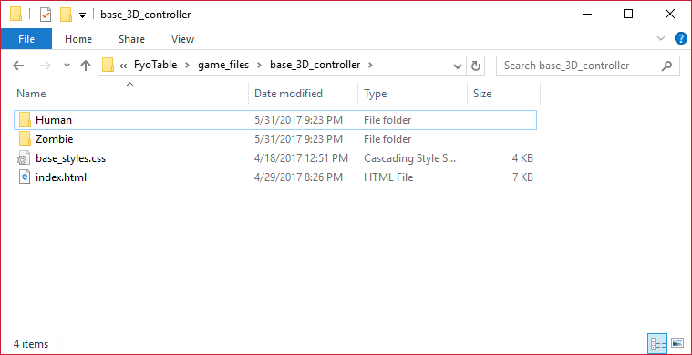

Controller Structure
===================

Each controller is designated as a folder with an index.html file in it. This is the bare minimum.

.. image:: FyoStructure.png

You can have multiple controllers, but each controller has to be in its own folder, with its own index.html file.

In the above example, there are 3 controllers. 

* base_3D_controller
* base_3D_controller/Human
* base_3D_controller/Zombie

When your controllers are ready all you have to do is zip the directory, and send it as the BinaryPayload.