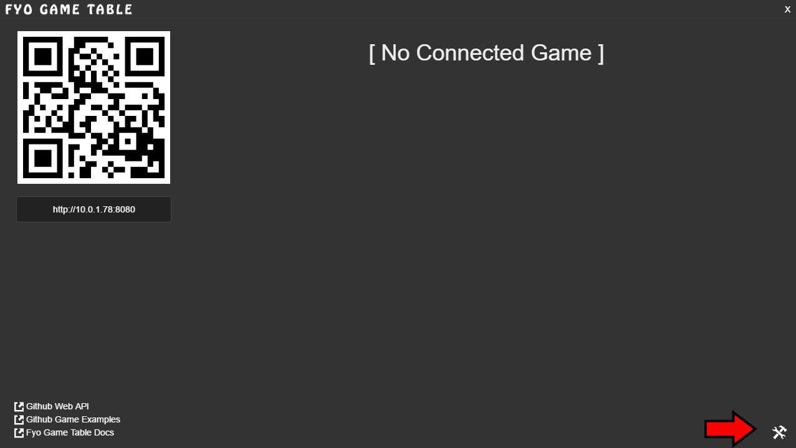

Fyo Controller Folder
===================

First open the Fyo Server ( http://docs.fyo.io/FyoGameTable.Release.zip ). Then open the utilities.

Click the "Open Controllers Folder" button.

.. image:: ../../images/FyoUtilitiesScreen.png

This will open an Explorer (or Finder) which is where the Socket Game Pad Controllers are served from.

.. image:: ../../images/FyoControllersFolder.png