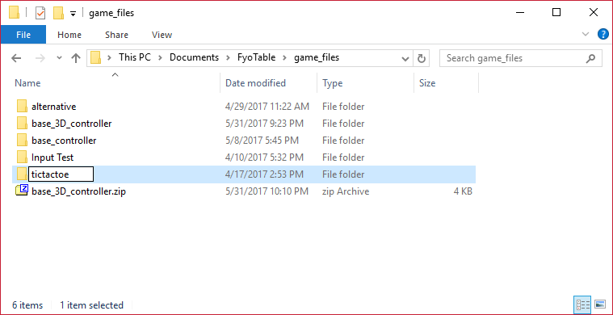

Setting up a Controller
===================

It will be easiest to start with one of the base controllers as a template. Copy and paste the folder under the game_files directory, and rename it to the name of your game.

Ex: If I was making a Tic Tac Toe clone, my app id would be tictactoe

# Or From Scratch

The controller has a connection to the Fyo Server via Socket.io (WebSockets). Socket.io is served up via the Fyo Server, which means socket.io has to be included via

.. code-block:: html

	

The next javascript library to be included is the Fyo Game Table API, which is also served up via the Fyo Server and is included via

.. code-block:: html

	

Now that the two required libraries are loaded, we just need to tell start the connection.

.. code-block:: javascript

	var connector = new FYO.FyoConnection('APPID');

Next up is adding controls, and interacting with the connector